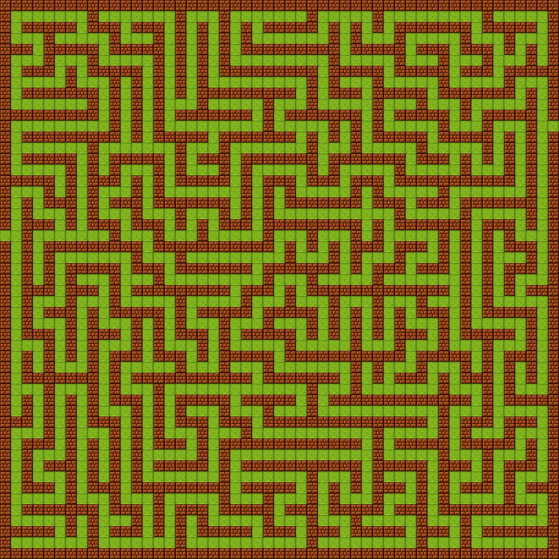

# Perfect Maze Generator

This project contains a program that generates _perfect mazes_ using a Depth-First Search algorithm combined with backtracking. As an added functionality, this program also creates an image representation for each generated maze for ease of visualization and for fun.

A _perfect maze_ is a maze in which there is exactly one path between any two cells and there are no loops, therefore it does not contain inacessible areas or dead ends.

## Compilation and Execution

To run this program, you will need to compile the C++ code and run the resulting executable. This program also utilizes an auxiliary python script to construct a .ppm image of the generated mazes. Ensure you have a C++ compiler (like `g++`) and Python 3 installed on your system. 

First, clone the repository:

```
git clone https://github.com/joaotav/perfect-maze-img-generator.git
```

Then, navigate into the cloned repository's directory and compile the source code using the following command:

```
g++ maze_generator.cpp -o maze_gen
```

To execute the program, run the following command:

```
./maze_gen <maze_height> <maze_width>
```
Where:
  - `<maze_height>`: the height of the maze to be generated.
  - `<maze_width>`: the width of the maze to be generated.

After execution, the image representation of the maze will be saved as `perfect_maze.ppm` and the maze configuration will be saved in the `maze.txt` file.

> [!NOTE]
> The larger a maze's dimensions, the longer it takes to be generated. 


### Example Output

Executing the program with both `maze_height` and `maze_width` set to 25 generates the following 25x25 maze:


